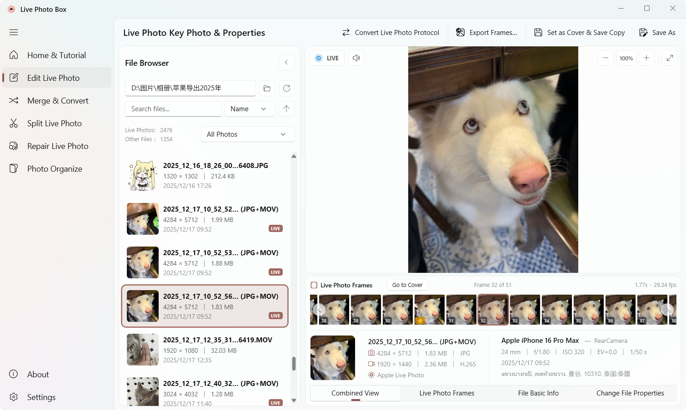
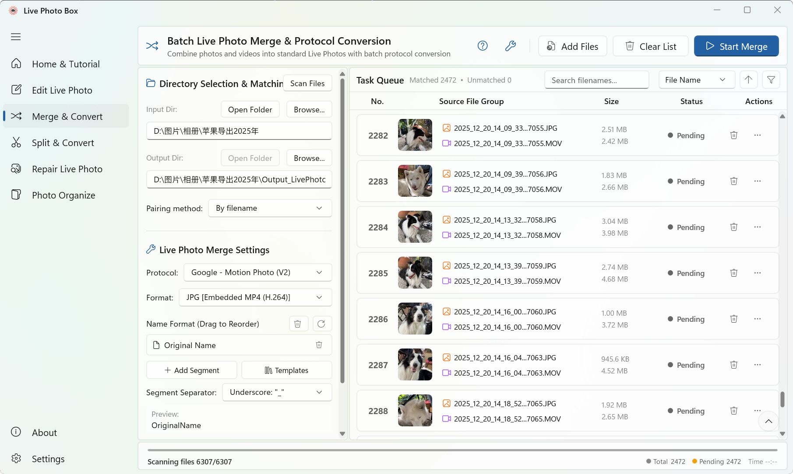

<div align="center">
<h1>
  
  Live Photo Box（实况照片工具箱）
</h1>
<p><em>Unifying all live photo protocols for seamless cross-device viewing & migration</em></p>

<p align="center">
  <a href="https://github.com/lengxiqwq/live-photo-box/releases"></a>
  <a href="https://github.com/lengxiqwq/live-photo-box/actions"></a>
  
  
  
  
</p>

---

<p align="center">
  📖 README Language: &nbsp;<strong>English  &nbsp;·&nbsp; <a href="README.zh-CN.md">简体中文</a></strong>
</p>

</div>

## 🚀 Download

<div align="center">
  <a href="https://apps.microsoft.com/detail/9n3d1qnrtvch?referrer=appbadge&mode=full" target="_blank" rel="noopener noreferrer"></a><a href="https://github.com/lengxiqwq/live-photo-box/releases"></a>
</div>
<p align="center">
</p>
<p align="center">
  Or install the <b>CLI</b> via <b>winget</b>: <code>winget install LengxiQwQ.LivePhotoBox</code>
</p>

---

## 💡 What Is This?

Every brand's Live Photos are essentially a still image + a short video clip, but each vendor uses its own incompatible container format. After switching phones or sharing across platforms, you often see:

- **No dynamic preview** — Windows shows only a static image
- **Metadata loss &amp; pairing corruption** — Live Photos degrade into plain JPEGs
- **Rotated or stretched videos** — playback looks wrong

**Live Photo Box** freely converts between all major protocols. Switch devices, share, migrate — your Live Photos stay alive.

---

## 📸 Screenshots

<p align="center"><b>🖼️ Live Photo Edit</b><br></p>

<p align="center"><b>🔗 Merge Live Photo</b><br></p>

---

## ✨ Core Features

### 🖼️ Live Photo Edit

Freely change your Live Photo cover — pick the perfect moment from the video timeline.

- Filmstrip timeline with frame-by-frame preview
- Replace cover, export a single frame, or all frames — or export the clip as video / GIF
- Quick Live Photo protocol conversion
- Inspect file properties and detect the Live Photo protocol

### 🔗 Merge Live Photo

Convert a **dual-file Live Photo** (or any image + video pair) into a **single-file Live Photo**, viewable on Windows and Android devices.

- **Merge anything in one click**: drag & drop or pick an image (`JPG` / `HEIC`) + a video (`MP4` / `MOV`), or scan a whole folder and auto-pair everything into a batch queue
- **Smart pairing**: match image + video automatically by filename, Apple `ContentIdentifier` UUID, or vivo camera ID
- **Any target protocol**: switch between all major phone protocols in one click, with `JPEG+MP4` / `JPEG+MOV` / `HEIC+MP4` / `HEIC+MOV` / `HEIC+MP4 (H.265)` outputs — available formats adapt to the selected protocol
- **Visual naming templates**: build filenames from segments (original name / protocol / date / time / EXIF date-time / counter / custom text) with drag-to-reorder, presets, separators, and live preview
- **Post-processing**: after merging, move outputs to a folder, or recycle the sources
- **Parallel batch merging**: a queue with search, multi-dimension sorting, and status filters — multiple tasks process in parallel with live progress, success/fail counts, and elapsed time

| Merge Protocol | Devices | Status |
|---|---|---|
| Google Micro Video | Windows / Xiaomi (legacy MIUI) / Pixel | ✅ Supported |
| Google Motion Photo | Windows / Xiaomi / Pixel | ✅ Supported |
| OPPO O-Live Photo | Windows / Xiaomi / OPPO | ✅ Supported |
| HUAWEI Moving Photo | HUAWEI / Honor | ✅ Supported |
| Samsung Motion Photo | Windows / Samsung | 🟡 In testing |
| vivo Live Photo | Windows / vivo (≥ X300) | 🟡 In testing |

### 📸 Split Live Photo

Split a **Live Photo** (single-file form) into an independent still image (`JPG` / `HEIC`) and video (`MP4` / `MOV`).

- Strips `XMP` metadata to prevent the split image from being erroneously re-identified as a Live Photo, while preserving all other metadata
- Rebuilds `JPEG` segment-by-segment; `EXIF` / `ICC` / `GPS` / shooting parameters are retained

| Split Protocol | Devices | Status |
|---|---|---|
| Apple Live Photo | iPhone / iPad | ✅ Supported |
| vivo Live Photo | vivo (≤ X200) | 🟡 In testing |

### 🛠️ Repair Live Photo

Repair the display anomalies that appear when Apple Live Photos are exported.

- **Excess thumbnail & horizontal stretch** (pre-iOS 17.3): Apple once embedded low-resolution thumbnails tagged with orientation, which Windows misinterprets as landscape, causing stretching or squashing. Losslessly fixed via `jpegtran` rotation + stripping the extraneous thumbnail
- **Front-camera video rotation**: the iPhone front camera stores vertical pixels horizontally and relies on an orientation tag — which Windows ignores. Fixed by `FFmpeg` re-encode to bake the rotation matrix into the pixel data
- **HEIC orientation correction**: rectifies miswritten `Orientation` tags
- **ContentIdentifier restoration**: auto-repairs photo-video `UUID` pairings
- Scan and review **diagnostic details** per photo; filter by file type or repair status

### 📂 Photo Organize (In Development)

Automatically scan, categorize, and archive photos by device, date, and Live Photo type based on EXIF metadata. Starting with iPhone photos, expanding to more brands.

---


## 💻 Command Line (CLI)

Live Photo Box ships a **command-line interface** — `livephotobox` — that shares 100% of its core logic with the GUI, ideal for scripting and AI agents.

- **Commands**: `merge` (single-pair or batch), `protocols` (protocol × format compatibility matrix), `update-check` (check for the latest release), `update` (check & install updates)
- **Four executable aliases**: `livephotobox` / `livephoto` / `livebox` / `lpb`
- **Batch merging** with metadata-based pairing (`name`, Apple `ContentIdentifier` UUID, vivo camera ID), custom naming templates, and `--after` actions (`move` to a folder / recycle bin)
- **Sane output defaults**: single-pair merges write next to the source photo (protocol-suffixed name); batch merges write into a `{folder}_<protocol>` subfolder — never the terminal’s current directory. `-w` overwrites existing outputs instead of auto-renaming
- **Distribution**: bundled with the installer (optional “Add to PATH”), or a standalone `-x64-cli.zip`

📖 **CLI User Guide**: [English](docs/CLI-User-Guide.md) · [简体中文](docs/CLI-User-Guide.zh-CN.md)

---

## 🛠️ Tech Stack

| Layer | Technology | Version |
|-------|-----------|---------|
| Language | C# | 13.0 |
| Runtime | .NET | 9.0 |
| UI Framework | Windows App SDK (WinUI 3) | 1.8 |
| Architecture | MVVM (CommunityToolkit.Mvvm) | 8.4.2 |
| Image Processing | Magick.NET (ImageMagick) + Win2D | 14.16.0 / 1.3.2 |
| Image Scaling | PhotoSauce.MagicScaler | 0.15.0 |
| Metadata Engine | `ExifTool` (daemon mode, v13.x) | — |
| Video Processing | `FFmpeg` (NVENC / QSV / AMF hardware acceleration) | — |
| JPEG Operations | `jpegtran` (lossless rotation, thumbnail stripping) | — |
| HEIC Codec | `libheif` (`heif-enc` / `heif-dec`) | — |
| Markdown Rendering | Markdig | 1.3.2 |
| UI Extensions | CommunityToolkit.WinUI + FluentIcons | — |
| Command Line | System.CommandLine | 2.0.0-beta4.22272.1 |
| Packaging | MSIX self-contained (no runtime required) | — |

---

## 💻 Build & Development

### Prerequisites

- [Visual Studio 2022](https://visualstudio.microsoft.com/) or later
- In VS Installer, select: **.NET desktop development** + **Universal Windows Platform development** (includes Windows App SDK components)
- [.NET 9 SDK](https://dotnet.microsoft.com/download/dotnet/9.0)

### Build

```bash
# Clone the repository
git clone https://github.com/lengxiqwq/live-photo-box.git
cd live-photo-box

# Restore NuGet packages
dotnet restore

# Build the project
dotnet build "LivePhotoBox/LivePhotoBox.csproj"

# Run
dotnet run --project "LivePhotoBox/LivePhotoBox.csproj"
```

---

## 📁 Project Structure

```
live-photo-box/
├── LivePhotoBox.Core/        # Shared core library (protocols, merge/split/repair services, localization)
├── LivePhotoBox/             # Main project (WinUI 3 MSIX app)
│   ├── Assets/               # Icons, screenshots, static resources
│   ├── Controls/             # Custom controls (fullscreen lightbox, status bar)
│   ├── Converters/           # XAML value converters
│   ├── Helpers/              # Utilities (scrolling, formatting, hover preview, etc.)
│   ├── Models/               # Data models
│   ├── Services/             # GUI business logic (delegates to LivePhotoBox.Core)
│   ├── Strings/              # Multilingual resources (zh-Hans / en-US)
│   ├── ViewModels/           # MVVM ViewModel layer
│   └── Views/                # XAML pages
├── LivePhotoBox.CLI/         # Command-line interface (livephotobox)
├── docs/                     # Project documentation
├── changelogs/               # Release notes
├── scripts/                  # Build & packaging scripts
├── screenshots/              # Screenshots
└── README.md
```

📖 See <strong><a href="docs/项目总览.md">Project Overview</a></strong> for the complete directory reference.

---

## 📋 Changelog

📋 CHANGELOG: &nbsp;<strong><a href="changelogs/CHANGELOG.md">English</a> &nbsp;·&nbsp; <a href="changelogs/CHANGELOG.zh-CN.md">简体中文</a></strong>

---

## 🌍 Localization

| Language | Status |
|----------|:------:|
| 中文（简体）(zh-Hans) | ✅ Complete |
| English (en) | ✅ Complete |

Follows system language automatically; can also be switched manually in Settings.

---

## 🤝 Contributing

Issues and Pull Requests are welcome!

- 🐛 **Bug reports** and 💡 **Feature requests** → [GitHub Issues](https://github.com/lengxiqwq/live-photo-box/issues)
- 🔧 **Code contributions** → Fork → Feature Branch → Pull Request

---

## 📄 License

This project is open-source under the **GNU General Public License v3.0 (GPL 3.0)**. See the [LICENSE](LICENSE) file for details.

---

## 🙏 Credits

| Tool / Library | Purpose | License |
|---------------|---------|---------|
| [FFmpeg](https://ffmpeg.org/) | Video transcoding and stream remuxing | LGPL/GPL |
| [ExifTool](https://exiftool.org/) by Phil Harvey | Global metadata parsing, injection, XMP reconstruction | Perl |
| [libheif](https://github.com/strukturag/libheif) | HEIC/HEIF encoding & decoding pipeline | LGPL-3.0 |
| [jpegtran](https://jpegclub.org/) | Lossless JPEG transforms (DCT coefficient space) | Free software |
| [Magick.NET](https://github.com/dlemstra/Magick.NET) by dlemstra | HEIC/HEIF decoding via libheif | Apache 2.0 |
| [CommunityToolkit.Mvvm](https://github.com/CommunityToolkit/dotnet) | MVVM framework | MIT |
| [PhotoSauce.MagicScaler](https://github.com/saucecontrol/PhotoSauce) | High-performance image scaling | MIT |
| [Markdig](https://github.com/xoofx/markdig) | Markdown rendering | BSD-2-Clause |
| [Win2D](https://github.com/microsoft/Win2D) | GPU-accelerated graphics | MIT |
| [FluentIcons](https://github.com/davidxuang/FluentIcons) | Fluent icon set | MIT |

---

## ⭐️ Star History

<a href="https://www.star-history.com/?repos=lengxiqwq%2Flive-photo-box&type=date&legend=top-left">
 <picture>
   <source media="(prefers-color-scheme: dark)" srcset="https://api.star-history.com/chart?repos=lengxiqwq/live-photo-box&type=date&theme=dark&legend=top-left&sealed_token=OaKwkWC2X0kmrzy16Wj7Qef0e-M9T5jTHXDQh3JN1hdjg3twCmEZxCJ3vmpH8ZMlK6jjI7F_ntJENcAl11D2S64ym_jrGAnMVVtAtYVCtgUGBaYy9T5JPQ" />
   <source media="(prefers-color-scheme: light)" srcset="https://api.star-history.com/chart?repos=lengxiqwq/live-photo-box&type=date&legend=top-left&sealed_token=OaKwkWC2X0kmrzy16Wj7Qef0e-M9T5jTHXDQh3JN1hdjg3twCmEZxCJ3vmpH8ZMlK6jjI7F_ntJENcAl11D2S64ym_jrGAnMVVtAtYVCtgUGBaYy9T5JPQ" />
   
 </picture>
</a>

<!-- INSIGHTS:START -->
**📊 Repository Traffic**

Views: **725** ｜ Uniques: **120** (14-day) ｜ Clones: **227** ｜ Cloners: **66** (14-day)

**Top referrers:** github.com · Google · Bing · doubao.com · chatgpt.com · developer.huawei.com.cn

> Data since 2026-08-02 · Last updated: 2026-08-16 16:46:16 UTC
<!-- INSIGHTS:END -->

---

<p align="center">
  <sub>Made with ❤️ by <a href="https://github.com/lengxiqwq">LengxiQwQ</a></sub>
</p>

<p align="center">
  <a href="https://github.com/lengxiqwq/live-photo-box/stargazers"></a>
  <a href="https://github.com/lengxiqwq/live-photo-box/network/members"></a>
  <a href="https://github.com/lengxiqwq/live-photo-box/releases"></a>
</p>
