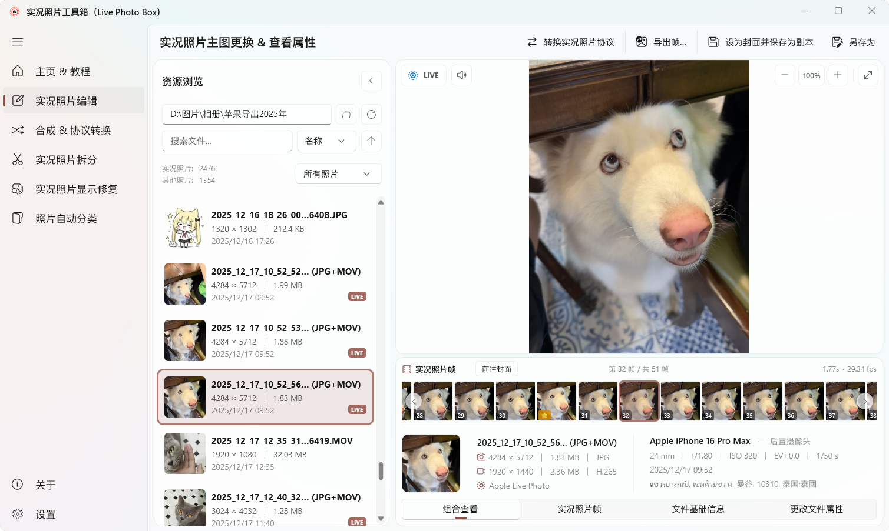
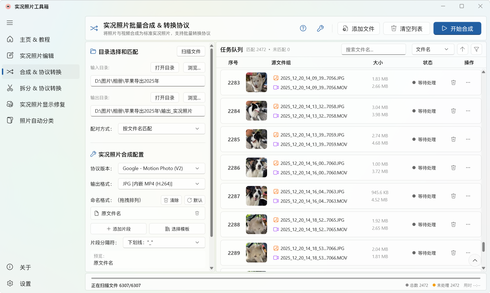

<div align="center">
<h1>
  
  Live Photo Box（实况照片工具箱）
</h1>
<p><em>统一各类实况照片协议，实现跨设备无缝查看与迁移</em></p>
<p align="center">
  <a href="https://github.com/lengxiqwq/live-photo-box/releases"></a>
  <a href="https://github.com/lengxiqwq/live-photo-box/actions"></a>
  
  
  
  


</p>
</div>

---

<p align="center">
  📖 README Language：<strong>简体中文</strong> &nbsp;·&nbsp; <a href="README.md">English</a>
</p>

## 🚀 下载

<div align="center">
  <a href="https://apps.microsoft.com/detail/9n3d1qnrtvch?referrer=appbadge&mode=full" target="_blank" rel="noopener noreferrer"></a><a href="https://github.com/lengxiqwq/live-photo-box/releases"></a>
</div>
<p align="center">
 
</p>
<p align="center">
  或通过 <b>winget</b> 安装 <b>纯命令行版本</b>： <code>winget install LengxiQwQ.LivePhotoBox</code>
</p>

---

## 💡 这是什么？

各品牌的实况照片（Live Photo）本质上都是一张照片 + 一段视频，但各家封装格式互不兼容。一旦跨品牌换机、跨平台分享，往往就会出现：

- **无法预览动态**：在 Windows 上只能看到一张静态图片
- **元数据丢失、配对失效**：实况照片退化成一张普通 JPEG
- **方向异常**：前置摄像头视频被旋转、拉伸，无法正常播放

**实况照片工具箱**支持在各种协议之间自由转换。换机、分享、迁移，动态依然鲜活。

---

## 📸 应用截图

<p align="center"><b>🖼️ 实况照片编辑</b><br></p>

<p align="center"><b>🔗 实况照片合成</b><br></p>

---

## ✨ 核心功能

### 🖼️ 实况照片编辑

自由更换实况照片的封面帧，从视频时间轴中选取最完美的一刻。

- 视频帧时间轴胶片条，逐帧预览
- 一键替换封面、导出单帧或全部视频帧，或者导出为视频以及 GIF 动图
- 快速实况照片协议转换
- 文件基本属性查看，实况照片协议查看

### 🔗 实况照片合成

将**双文件实况照片协议**（或任意图片 + 视频）转换为**单文件实况照片**，在 Windows 及 Android 设备上均可查看。

- **任意素材，一键合成**：拖拽或选择图片（`JPG` / `HEIC`）+ 视频（`MP4` / `MOV`）直接合成；也可以扫描整个文件夹，自动识别配对、批量入队
- **多种智能配对**：按文件名、Apple `ContentIdentifier` UUID、vivo 相机 ID 自动匹配图片与视频
- **多品牌协议自由切换**：主流品牌目标协议一键切换，配合 `JPEG+MP4` / `JPEG+MOV` / `HEIC+MP4` / `HEIC+MOV` / `HEIC+MP4(H.265)` 输出格式，随协议自动筛选可用项
- **可视化命名模板**：片段式编排（原名 / 协议 / 日期 / 时间 / EXIF 日期时间 / 计数器 / 自定义文本），支持拖拽排序、预设模板、分隔符选择与实时预览
- **收尾处理**：合成完成后可选择移动到指定目录，或移入回收站
- **并行批量合成**：任务队列支持搜索、多维度排序与状态筛选，多任务并行处理，实时显示进度、成功/失败统计与耗时

| 合成协议 | 支持设备 | 状态 |
|---|---|---|
| Google Micro Video | Windows / 小米 (旧版 MIUI) / Pixel | ✅ 可用 |
| Google Motion Photo | Windows / 小米 / Pixel | ✅ 可用 |
| OPPO O-Live Photo | Windows / 小米 / OPPO | ✅ 可用 |
| HUAWEI Moving Photo | 华为 / 荣耀 | ✅ 可用 |
| Samsung Motion Photo | Windows / Samsung | 🟡 测试中 |
| vivo Live Photo | Windows / vivo（≥ x300） | 🟡 测试中 |

### 📸 实况照片拆分

将**实况照片**（单文件形式）拆分为独立的静态图片（`JPG` / `HEIC`）和视频（`MP4` / `MOV`）。

- 智能剥离 `XMP` 元数据，防止拆分后的图片被再次误识别为实况照片。但保留照片其他元数据
- 按 `JPEG` 段结构逐段重建，不丢失 `EXIF` / `ICC` / `GPS` / 拍摄参数

| 拆分协议 | 支持机型 | 状态 |
|---|---|---|
| Apple Live Photo | iPhone / iPad | ✅ 可用 |
| vivo Live Photo | vivo（≤ x200） | 🟡 测试中 |

### 🛠️ 实况照片修复

修复 Apple 实况照片导出后出现的显示异常。

- **多余缩略图及横向拉伸**（iOS 17.3 之前）：Apple 曾嵌入低分辨率缩略图但带有方向标签，Windows 误将其当作横向图片处理，导致拉宽或压扁 。我们使用 `jpegtran` 无损旋转 + 剥离多余缩略图
- **前置摄像头视频旋转**：iPhone 前置镜头纵向像素横向存储，依赖方向标签指示角度，Windows 不识别。我们用 `FFmpeg` 重编码消除旋转矩阵
- **HEIC 方向错误**：修正错误的 `Orientation` 标签
- **ContentIdentifier 丢失**：自动修复照片-视频的 `UUID` 配对关系
- 扫描后可查看每张照片的**诊断详情**，可以按文件类型或修复状态快速筛选

### 📂 自动整理相册（功能开发中）

通过识别照片元数据，自动按拍摄设备、日期、实况照片类型自动扫描分类归档。首批从 iPhone 起步，逐步覆盖更多品牌。

---

## 💻 命令行工具

Live Photo Box 提供**命令行工具** —— `livephotobox`，与 GUI 共享 100% 核心逻辑，适合脚本和 AI Agent 调用。

- **命令**：`merge`（单对或批量合成）、`protocols`（协议 × 格式兼容矩阵）、`update-check`（检查最新版本）、`update`（检查并安装更新）
- **四个可执行别名**：`livephotobox` / `livephoto` / `livebox` / `lpb`
- **批量合成**：支持基于元数据的配对（`name`、Apple `ContentIdentifier` UUID、vivo 相机 ID）、自定义命名模板、`--after` 动作（移动到文件夹 / 回收站）
- **合理的输出默认值**：单对合成默认输出到源照片所在目录（文件名带协议后缀）；批量合成默认输出到 `{文件夹}_{协议}` 子文件夹——绝不会落到终端当前目录。`-w` 直接覆盖已存在的输出而非自动重命名
- **分发**：随安装包内置（可选"添加到 PATH"），或独立 `-x64-cli.zip`

📖 **CLI 使用指南**：[English](docs/CLI-User-Guide.md) · [简体中文](docs/CLI-User-Guide.zh-CN.md)

---


## 🛠️ 技术栈

| 层级 | 技术 | 版本 |
|------|------|------|
| 语言 | C# | 13.0 |
| 运行时 | .NET | 9.0 |
| UI 框架 | Windows App SDK（WinUI 3） | 1.8 |
| 架构 | MVVM（CommunityToolkit.Mvvm） | 8.4.2 |
| 图像处理 | Magick.NET（ImageMagick）+ Win2D | 14.16.0 / 1.3.2 |
| 图像缩放 | PhotoSauce.MagicScaler | 0.15.0 |
| 元数据引擎 | `ExifTool`（常驻进程模式，v13.x） | — |
| 视频处理 | `FFmpeg`（NVENC / QSV / AMF 硬件加速） | — |
| JPEG 操作 | `jpegtran`（无损旋转、缩略图剥离） | — |
| HEIC 编解码 | `libheif`（`heif-enc` / `heif-dec`） | — |
| Markdown 渲染 | Markdig | 1.3.2 |
| UI 扩展 | CommunityToolkit.WinUI + FluentIcons | — |
| 命令行 | System.CommandLine | 2.0.0-beta4.22272.1 |
| 打包 | MSIX 自包含（无需安装运行时） | — |

---

## 💻 编译与开发

### 环境

- [Visual Studio 2022](https://visualstudio.microsoft.com/) 及以上
- 在 VS Installer 中勾选：**.NET 桌面开发** + **通用 Windows 平台开发**（含 Windows App SDK 组件）
- [.NET 9 SDK](https://dotnet.microsoft.com/download/dotnet/9.0)

### 构建

```bash
# 克隆仓库到本地
git clone https://github.com/lengxiqwq/live-photo-box.git
cd live-photo-box

# 还原 NuGet 依赖包
dotnet restore

# 编译项目
dotnet build LivePhotoBox/LivePhotoBox.csproj

# 启动运行
dotnet run --project LivePhotoBox/LivePhotoBox.csproj
```

---

## 📁 项目结构

```
live-photo-box/
├── LivePhotoBox.Core/        # 共享核心库（协议、合成/拆分/修复服务、本地化）
├── LivePhotoBox/             # 主项目（WinUI 3 MSIX 应用）
│   ├── Assets/               # 图标、教程截图等静态资源
│   ├── Controls/             # 自定义控件（全屏灯箱、底部状态栏）
│   ├── Converters/           # XAML 值转换器
│   ├── Helpers/              # 工具类（滚动、格式化、悬停预览等）
│   ├── Models/               # 数据模型
│   ├── Services/             # GUI 业务逻辑层（委托给 LivePhotoBox.Core）
│   ├── Strings/              # 多语言资源（中文 / 英文）
│   ├── ViewModels/           # MVVM ViewModel 层
│   └── Views/                # XAML 页面
├── LivePhotoBox.CLI/         # 命令行工具（livephotobox）
├── docs/                     # 项目文档
├── changelogs/               # 更新日志
├── scripts/                  # 构建与打包脚本
├── screenshots/              # 截图资源
└── README.md
```

📖 完整目录说明见 <strong><a href="docs/项目总览.md">项目总览</a></strong>

---

## 📋 更新日志

📋 CHANGELOG：<strong><a href="changelogs/CHANGELOG.zh-CN.md">简体中文</a> &nbsp;·&nbsp; <a href="changelogs/CHANGELOG.md">English</a></strong>

---

## 🌍 本地化

| 语言 | 状态 |
|------|:----:|
| 中文（简体）(zh-Hans) | ✅ 完整 |
| English (en) | ✅ 完整 |

支持系统语言自动跟随，也可在设置中手动切换。

---

## 🤝 贡献

欢迎提交 Issue 和 Pull Request！

- 🐛 **Bug 报告**、💡 **功能建议** → [GitHub Issues](https://github.com/lengxiqwq/live-photo-box/issues)
- 🔧 **代码贡献** → Fork → Feature Branch → Pull Request

---

## 📄 许可证

本项目基于 **GNU General Public License v3.0 (GPL 3.0)** 开源。详见 [LICENSE](LICENSE) 文件。

---

## 🙏 致谢

| 工具/库 | 用途 | 许可 |
|---------|------|------|
| [FFmpeg](https://ffmpeg.org/) | 视频编解码 | LGPL/GPL |
| [ExifTool](https://exiftool.org/) | 图像/视频元数据读写 | Perl |
| [libheif](https://github.com/strukturag/libheif) | HEIC/HEIF 编解码管线 | LGPL-3.0 |
| [jpegtran](https://jpegclub.org/) | JPEG 无损变换 | 自由软件 |
| [Magick.NET](https://github.com/dlemstra/Magick.NET) | HEIC 解码 | Apache 2.0 |
| [CommunityToolkit.Mvvm](https://github.com/CommunityToolkit/dotnet) | MVVM 框架 | MIT |
| [PhotoSauce.MagicScaler](https://github.com/saucecontrol/PhotoSauce) | 高性能图片缩放 | MIT |
| [Markdig](https://github.com/xoofx/markdig) | Markdown 渲染 | BSD-2-Clause |
| [Win2D](https://github.com/microsoft/Win2D) | GPU 加速图形 | MIT |
| [FluentIcons](https://github.com/davidxuang/FluentIcons) | Fluent 图标集 | MIT |

---

## ⭐ Star 历史

<a href="https://www.star-history.com/?repos=lengxiqwq%2Flive-photo-box&type=date&legend=top-left">
 <picture>
   <source media="(prefers-color-scheme: dark)" srcset="https://api.star-history.com/chart?repos=lengxiqwq/live-photo-box&type=date&theme=dark&legend=top-left&sealed_token=OaKwkWC2X0kmrzy16Wj7Qef0e-M9T5jTHXDQh3JN1hdjg3twCmEZxCJ3vmpH8ZMlK6jjI7F_ntJENcAl11D2S64ym_jrGAnMVVtAtYVCtgUGBaYy9T5JPQ" />
   <source media="(prefers-color-scheme: light)" srcset="https://api.star-history.com/chart?repos=lengxiqwq/live-photo-box&type=date&legend=top-left&sealed_token=OaKwkWC2X0kmrzy16Wj7Qef0e-M9T5jTHXDQh3JN1hdjg3twCmEZxCJ3vmpH8ZMlK6jjI7F_ntJENcAl11D2S64ym_jrGAnMVVtAtYVCtgUGBaYy9T5JPQ" />
   
 </picture>
</a>

<!-- INSIGHTS:START -->
**📊 仓库流量**

访问次数：**725** ｜ 不重复访客：**120**（近 14 天） ｜ 仓库克隆：**227** ｜ 不重复克隆：**66**（近 14 天）

**热门来源：** github.com · Google · Bing · doubao.com · chatgpt.com · developer.huawei.com.cn

> 数据开始：2026-08-02 · 最后更新：2026-08-17 01:10:25 (UTC+8)
<!-- INSIGHTS:END -->

---

<p align="center">
  <sub>Made with ❤️ by <a href="https://github.com/lengxiqwq">LengxiQwQ</a></sub>
</p>

<p align="center">
  <a href="https://github.com/lengxiqwq/live-photo-box/stargazers"></a>
  <a href="https://github.com/lengxiqwq/live-photo-box/network/members"></a>
  <a href="https://github.com/lengxiqwq/live-photo-box/releases"></a>
</p>
