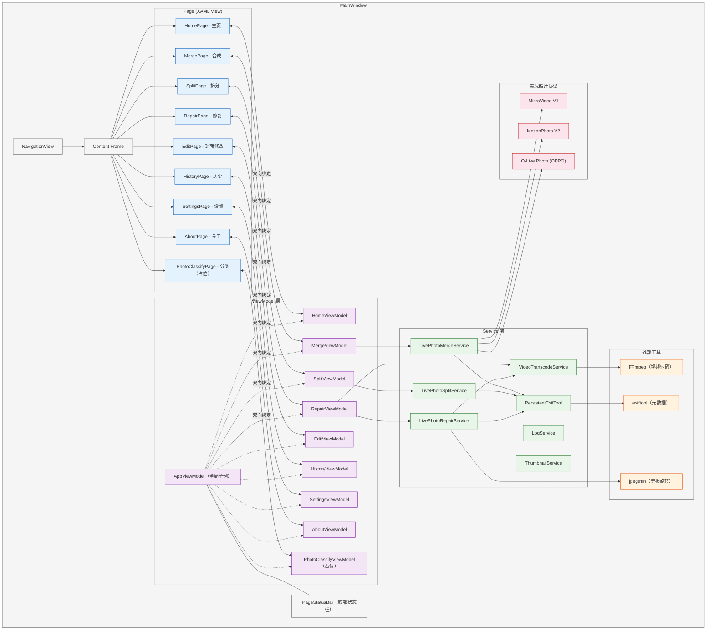
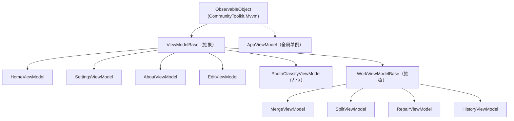
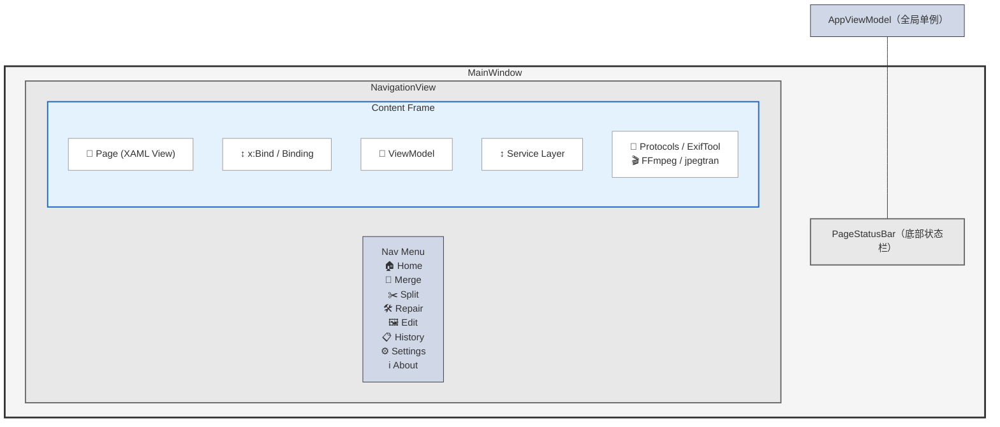

# Live Photo Box — 项目总览

> **创建日期**: 2026-06-26  
> **最后更新**: 2026-07-18  
> **作者**: LengxiQwQ  
> **仓库**: https://github.com/lengxiqwq/live-photo-box  
> **许可**: GPL 3.0

---

## 1. 项目概述

**Live Photo Box（实况照片工具箱）**是一款专为 Windows 打造的 Apple 实况照片 (Live Photos) 管理与修复桌面应用。基于 **WinUI 3 (Windows App SDK 1.8)** 构建，原生适配 Windows 11 Fluent Design 设计规范，支持 Mica / Acrylic 材质、深色/浅色主题自动切换。

### 核心功能

| 功能 | 说明 |
|------|------|
| **🔗 实况照片合成 (Combo)** | 将任意静态图片 + 视频素材组合为标准实况照片。支持 `Micro Video V1` / `Motion Photo V2` / `O-Live Photo`（OPPO）等协议，自动写入完整 `EXIF` + `QuickTime` 元数据 |
| **📸 实况照片拆分 (Split)** | 一键拆分为独立静态图片（`JPG` / `HEIC`）和视频（`MOV` / `MP4`）。智能剥离 Google `XMP` 元数据，按 `JPEG` 段结构逐段重建 |
| **🛠️ 实况照片修复 (Repair)** | 深度修复 iPhone 实况照片导出到 Windows 后的显示异常（缩略图拉伸、前置旋转、HEIC 方向、UUID 丢失） |
| **🖼️ 封面修改 (Edit)** | 自由更换实况照片封面帧，支持视频时间轴帧选取 + 缩略图条 + 实时播放预览 |
| **📂 自动整理相册** | 按拍摄设备、日期、实况照片类型自动扫描分类归档（功能开发中） |

---

## 2. 技术栈详情

### 语言与框架

| 层级 | 技术 | 版本 |
|------|------|------|
| 语言 | C# | 13.0 |
| 运行时 | .NET | 9.0 |
| UI 框架 | Windows App SDK（WinUI 3） | 1.8 |
| 架构 | MVVM（CommunityToolkit.Mvvm） | 8.4.2 |
| 最低系统 | Windows 10 (1809+) | 10.0.19041.0 |

### 关键 NuGet 依赖

| 包名 | 版本 | 用途 |
|------|------|------|
| `CommunityToolkit.Mvvm` | 8.4.2 | MVVM 架构 (ObservableObject, RelayCommand, 源生成器) |
| `CommunityToolkit.WinUI.Controls.Primitives` | 8.2.251219 | WinUI 扩展控件 |
| `CommunityToolkit.WinUI.Controls.Segmented` | 8.2.251219 | Segmented 分段控件 |
| `CommunityToolkit.WinUI.Controls.SettingsControls` | 8.2.251219 | 设置页卡片控件 |
| `FluentIcons.WinUI` | 2.0.320 | Fluent 图标库 |
| `Magick.NET-Q16-x64` | 14.14.0 | ImageMagick 图像处理 (HEIC 解码) |
| `Markdig` | 1.3.2 | Markdown 渲染（关于页/更新日志） |
| `Microsoft.Graphics.Win2D` | 1.3.2 | GPU 加速 2D 图形渲染 |
| `Microsoft.Windows.SDK.BuildTools` | 10.0.26100.7705 | Windows SDK 构建工具 |
| `Microsoft.WindowsAppSDK` | 1.8.260317003 | Windows App SDK 运行时 |
| `Microsoft.Xaml.Behaviors.WinUI.Managed` | 3.0.0 | XAML 行为 (EventTriggerBehavior 等) |
| `System.Management` | 8.0.0 | WMI 硬件信息查询 |

### 外部工具依赖 (自动探测 PATH 或 Tools/ 目录)

| 工具 | 用途 |
|------|------|
| **ExifTool** (v13.x) | 图像/视频元数据读写（常驻进程模式，`-stay_open` 复用） |
| **FFmpeg** | 视频编解码，支持 NVENC / QSV / AMF 硬件加速（定制编译，~5.8 MB） |
| **jpegtran** | JPEG 无损旋转、缩略图剥离 |
| **heif-dec / heif-enc** (libheif) | HEIC/HEIF 解码与编码（定制编译，~3 MB） |

---

## 3. 支持的实况照片协议

| 协议 | 来源 | 说明 |
|------|------|------|
| `Micro Video V1` | Google（已弃用，但老设备兼容性高） | `MP4` 视频附加在 `JPEG` 末尾，`GCamera:MicroVideoOffset` 记录偏移。旧版小米 MIUI / 旧版 Pixel 使用 |
| `Motion Photo V2` | Google | 现代标准，`Container:Directory` `XMP` 结构。Google Pixel / Xiaomi HyperOS 3+ 使用 |
| `O-Live Photo` | OPPO / OnePlus | 扩展 `Motion Photo V2`，增加 `OpCamera` 命名空间 + `EXIF` `UserComment`。OPPO ColorOS / OnePlus OxygenOS 使用 |

> ⚡ 目前任何协议合成的实况照片，均可在 Windows 11 上直接查看动态效果。

---

## 4. 项目目录树

### 目录速览（仅文件夹）

> 只看目录结构，不看具体文件。快速了解每个文件夹的用途。

```
live-photo-box/
├── .github/workflows/                  — CI/CD 自动构建与发布
├── changelogs/                         — 版本更新日志
├── docs/                               — 项目文档
├── LivePhotoBox/
│   ├── Live Photo Box.csproj           — 项目文件
│   ├── Package.appxmanifest            — MSIX 包清单（版本号来源）
│   ├── App.xaml / App.xaml.cs          — 应用入口
│   ├── MainWindow.xaml/.cs             — 主窗口（导航 + 主题）
│   ├── Assets/                         — 静态资源（图标 / Banner / 示例 / 教程）
│   ├── Controls/                       — 自定义 XAML 控件
│   ├── Converters/                     — XAML 值转换器
│   ├── Helpers/                        — UI 辅助工具类
│   ├── Models/                         — 数据模型
│   ├── Services/                       — 核心业务逻辑
│   │   └── Protocols/                  — 实况照片协议实现
│   ├── Strings/                        — 多语言资源 (en-US / zh-Hans)
│   ├── Tools/                          — 外部工具（exiftool / ffmpeg / heif 等）
│   ├── ViewModels/                     — MVVM ViewModel 层
│   └── Views/                          — XAML 页面
├── screenshots/                        — README 应用截图
├── scripts/                            — 构建与工具脚本
├── Live Photo Box.sln                  — VS 解决方案
├── README.md / README.zh-CN.md         — 项目说明（英/中）
└── LICENSE                             — GPL 3.0
```

### 完整目录树

```
live-photo-box/
├── .github/                          # GitHub 相关配置
│   ├── copilot-instructions.md       # GitHub Copilot AI 指令
│   └── workflows/
│       ├── build.yml                 # 自动构建与发布
│       └── cleanup.yml               # 定期清理旧 Artifacts 和 Caches
│
├── changelogs/                       # 版本更新日志
│   ├── CHANGELOG.md                  # 英文更新日志总览
│   ├── CHANGELOG.zh-CN.md            # 中文更新日志总览
│   └── release-v*.md                # 各版本发布说明（v1.14~v2.0）
│
├── docs/                             # 项目文档
│   ├── WinUI3开发注意事项.md          # WinUI 3 AI 常踩坑速查卡
│   ├── 历史记录标识规范.md            # XMP 历史标记技术规范
│   ├── 发布流程.md                   # 自动发布 + Release Notes 格式
│   ├── 外部工具定制编译指南.md        # FFmpeg / libheif 定制编译
│   ├── 小米实况照片协议分析报告.md    # 小米实况照片协议逆向分析
│   ├── 顽疾修复记录.md               # WinUI 3 疑难杂症排查记录
│   ├── 性能测试报告.md               # EditPage 资源浏览性能压测
│   └── 项目总览.md                   # 👈 本文件
│
├── screenshots/                     # 应用截图（中英文各页面 + 徽标）
│
├── scripts/                         # 构建与工具脚本
│   ├── build-release.ps1            # 本地发布打包（zip + Inno Setup）
│   ├── build-dev.ps1                # 开发构建
│   ├── Generate-AppIcons.ps1        # 应用图标自动生成
│   ├── check_pkg.ps1                # 包 / 证书检查
│   └── setup.iss                    # Inno Setup 安装包配置
│
├── LivePhotoBox/                  # 📦 主项目 (WinUI 3 非打包自包含)
│   ├── Live Photo Box.csproj        # 项目文件（MSBuild SDK 风格）
│   ├── Package.appxmanifest         # MSIX 包清单（版本号来源）
│   ├── app.manifest                 # Windows 应用程序清单（DPIAware 等）
│   ├── App.xaml / App.xaml.cs       # 应用入口，全局初始化
│   ├── MainWindow.xaml / MainWindow.xaml.cs  # 主窗口，导航与主题管理
│   │
│   ├── Assets/                      # 静态资源
│   │   ├── Icons/                   # 应用图标（多分辨率）
│   │   ├── Banners/                 # 首页 Banner 图片
│   │   ├── Samples/                 # 示例文件（Merge / Repair / Split）
│   │   └── Tutorials/               # 教程图片
│   │
│   ├── Collections/                 # 自定义集合类
│   │   └── BulkObservableCollection.cs  # 高性能批量可观察集合
│   │
│   ├── Controls/                    # 自定义 XAML 控件
│   │   ├── LightboxPreview.xaml/.cs # 全屏灯箱预览（双播放器无缝切换）
│   │   ├── PageStatusBar.xaml/.cs   # 底部状态栏
│   │   ├── PhotoViewer.xaml/.cs     # 图片缩放平移查看器
│   │   ├── PureMediaViewer.xaml/.cs # 纯媒体播放器（无 UI 装饰）
│   │   └── SnapPanel.cs            # 吸附布局面板（时间轴辅助线对齐）
│   │
│   ├── Converters/                  # XAML 值转换器
│   │   ├── BackdropToAcrylicVisibilityConverter.cs  # 背景材质 → Acrylic 可见性
│   │   ├── BoolToDiagnosisErrorBrushConverter.cs    # 诊断错误 → 红色画刷
│   │   ├── CommonConverters.cs      # Bool ↔ Visibility 通用转换
│   │   ├── DoubleToPercentConverter.cs              # 0~1 → "50%" 字符串
│   │   ├── ProgressBarForegroundConverter.cs        # 进度条状态 → 前景色
│   │   ├── ProgressBarIndeterminateConverter.cs     # 进度条状态 → 不确定模式
│   │   └── StatusToColorConverter.cs                # 处理状态 → 颜色画刷
│   │
│   ├── Helpers/                     # UI 辅助工具类
│   │   ├── ComboBoxHelper.cs        # ComboBox 自适应宽度
│   │   ├── FileNameFormatter.cs     # 文件名截断显示
│   │   ├── FileSizeFormatter.cs     # 文件大小格式化（字节 → KB/MB）
│   │   ├── ImageHoverService.cs     # 首页功能卡片悬停动效
│   │   ├── ScrollToTopButton.cs     # 页面滚动到顶部按钮
│   │   ├── TaskListAutoScroller.cs  # 任务列表自动滚动（处理时跟随）
│   │   ├── TaskListScrollHelper.cs  # 任务列表滚动逻辑封装
│   │   └── VisualTreeHelperExtensions.cs  # 可视树扩展方法
│   │
│   ├── Models/                      # 数据模型
│   │   ├── AppLogEntry.cs           # 日志条目
│   │   ├── BannerPreset.cs          # 首页 Banner 预设
│   │   ├── EditFileItem.cs          # 封面帧文件项
│   │   ├── FileHistoryInfo.cs       # 照片操作历史记录
│   │   ├── GitHubReleaseInfo.cs     # GitHub Release 元数据（自动更新用）
│   │   ├── LightboxItem.cs          # 灯箱播放队列项
│   │   ├── LivePhotoConstants.cs    # 实况照片共享常量与枚举
│   │   ├── LivePhotoDiscoveryModels.cs  # 实况照片自动发现模型
│   │   ├── LivePhotoSplitResult.cs  # 拆分结果（照片+视频路径）
│   │   ├── MergeTask.cs             # 合并任务（图片+视频配对）
│   │   ├── ProcessStatus.cs         # 任务处理状态枚举
│   │   ├── ProgressBarState.cs      # 进度条运行状态枚举
│   │   ├── RepairAnalysisResult.cs  # 修复诊断分析结果
│   │   ├── RepairFileEntry.cs       # 修复队列文件条目
│   │   ├── RepairOptions.cs         # 修复参数选项
│   │   ├── RepairTask.cs            # 修复队列任务单元
│   │   ├── SplitTask.cs             # 拆分任务
│   │   ├── ThumbnailStripItem.cs    # 缩略图条项目
│   │   ├── TimelineFrame.cs         # 时间轴帧数据
│   │   └── WorkProgressSnapshot.cs  # 工作进度快照
│   │
│   ├── Services/                    # 服务层（核心业务逻辑）
│   │   ├── AppSettingsService.cs    # 应用设置键值存储
│   │   ├── CrashHandler.cs          # 崩溃处理与 WER dump 注册
│   │   ├── DialogService.cs         # 对话框统一管理（队列化显示）
│   │   ├── EditTimingService.cs     # 封面帧时间轴计算
│   │   ├── EncoderHelper.cs         # 硬件编码器检测与参数配置
│   │   ├── ExternalToolLocator.cs   # 外部工具路径定位（Lazy 缓存）
│   │   ├── FeedbackService.cs       # 导航到 GitHub Issues
│   │   ├── FilePickerService.cs     # 文件/文件夹选择器封装
│   │   ├── HardwareService.cs       # CPU/GPU 硬件信息检测
│   │   ├── HeicConverterService.cs  # HEIC 转换（Magick.NET + BitmapDecoder）
│   │   ├── ImagePreviewService.cs   # 图片预览（LRU 缓存 + 预加载）
│   │   ├── LanguageService.cs       # UI 语言索引映射与切换
│   │   ├── LightboxItemSource.cs    # 灯箱增量加载源（分页）
│   │   ├── LivePhotoBatchRunnerService.cs   # 批量测试运行器
│   │   ├── LivePhotoCompositionService.cs   # 合成兼容层（文件名生成+写入）
│   │   ├── LivePhotoDiscoveryService.cs    # 实况照片自动发现
│   │   ├── LivePhotoMergeRunnerService.cs  # 合并批量执行器
│   │   ├── LivePhotoMergeScanService.cs    # 合并扫描（图片+视频配对）
│   │   ├── LivePhotoMergeService.cs        # 核心合并服务（XMP 构建+二进制拼接）
│   │   ├── LivePhotoMetadataMatcher.cs     # 元数据匹配
│   │   ├── LivePhotoRepairService.cs       # 修复服务（诊断→修复→标记）
│   │   ├── LivePhotoSplitScanService.cs   # 拆分扫描
│   │   ├── LivePhotoSplitService.cs       # 核心拆分服务（JPEG 段逐段剥离）
│   │   ├── LogService.cs           # 统一日志系统（ConcurrentQueue + 异步刷新）
│   │   ├── MarkdownRenderService.cs # Markdown → XAML 渲染
│   │   ├── PathHelper.cs           # 文件路径工具（配对键/唯一路径）
│   │   ├── PersistentExifTool.cs   # 常驻 exiftool 封装（进程复用）
│   │   ├── ResourceService.cs      # 多语言 ResourceLoader 封装
│   │   ├── ThumbnailService.cs     # 缩略图服务（三级来源 + 两级缓存）
│   │   ├── UpdateService.cs        # GitHub 自动更新检查
│   │   ├── VideoFrameExtractionService.cs  # 视频帧提取
│   │   ├── VideoTranscodeService.cs        # 视频转码（FFmpeg 封装）
│   │   └── WindowsAppSdkBootstrap.cs       # WinRT 启动引导（ModuleInitializer）
│   │
│   │   └── Protocols/               # 实况照片协议实现
│   │       ├── LivePhotoProtocol.cs          # 抽象基类
│   │       ├── MicroVideoV1Protocol.cs       # Google MicroVideo V1（已弃用）
│   │       ├── MotionPhotoV2Protocol.cs      # Google MotionPhoto V2（现代标准）
│   │       └── OppoLivePhotoProtocol.cs      # OPPO / OnePlus O-Live
│   │
│   ├── Strings/                     # 多语言资源
│   │   ├── en-US/Resources.resw     # 英文 UI 字符串
│   │   └── zh-Hans/Resources.resw   # 中文（简体）UI 字符串
│   │
│   ├── Tools/                       # 外部工具二进制（随应用分发）
│   │   ├── exiftool.exe             # 图像/视频元数据读写
│   │   ├── exiftool_files/          # exiftool Perl 运行环境
│   │   ├── ffmpeg.exe              # 视频编解码（定制编译 ~5.8 MB）
│   │   ├── heif-dec.exe            # HEIC → JPEG 解码器
│   │   ├── heif-enc.exe            # JPEG → HEIC 编码器
│   │   └── jpegtran.exe            # JPEG 无损旋转
│   │
│   ├── ViewModels/                  # MVVM ViewModel 层
│   │   ├── ViewModelBase.cs         # 所有 VM 抽象基类
│   │   ├── WorkViewModelBase.cs     # 工作流页面基类（扫描/处理/暂停/取消）
│   │   ├── WorkViewModelBase.ScanStateHook.cs  # 扫描状态变更钩子
│   │   ├── AboutViewModel.cs        # 关于页 VM
│   │   ├── AppViewModel.cs          # 全局应用 VM（管理子 VM + 状态栏）
│   │   ├── EditViewModel.cs         # 封面修改页 VM
│   │   ├── HistoryViewModel.cs      # 历史页 VM（XMP 解析 + 时间线）
│   │   ├── HomeViewModel.cs         # 首页 / 教程页 VM
│   │   ├── MergeViewModel.cs        # 合成页 VM
│   │   ├── PhotoClassifyViewModel.cs # 照片分类页 VM（占位）
│   │   ├── RepairViewModel.cs       # 修复页 VM
│   │   ├── SettingsViewModel.cs     # 设置页 VM
│   │   └── SplitViewModel.cs        # 拆分页 VM
│   │
│   └── Views/                       # XAML 页面
│       ├── AboutPage.xaml/.cs       # 关于页 — 应用信息 / 致谢 / 隐私
│       ├── EditPage.xaml/.cs        # 封面修改页 — 帧选取 + 时间轴 + 预览
│       ├── HistoryPage.xaml/.cs     # 历史页 — 文件操作历史分析
│       ├── HomePage.xaml/.cs        # 主页 — 欢迎信息 + 图文教程
│       ├── MergePage.xaml/.cs       # 合成页 — 图片+视频 → 实况照片
│       ├── PhotoClassifyPage.xaml/.cs  # 照片分类页（占位）
│       ├── RepairPage.xaml/.cs      # 修复页 — 诊断 + 修复实况照片
│       ├── SettingsPage.xaml/.cs    # 设置页（新版）— 外观 / 转码 / 调试
│       ├── SettingsPageOld.xaml/.cs # 设置页（旧版）— 经典布局
│       └── SplitPage.xaml/.cs       # 拆分页 — 实况照片 → 图片+视频
│
├── .gitattributes                    # Git 换行符等属性配置
├── .gitignore                        # Git 忽略规则
├── Live Photo Box.sln                # Visual Studio 解决方案
├── README.md                         # 项目说明（英文）
├── README.zh-CN.md                   # 项目说明（中文）
└── LICENSE                           # GPL 3.0 许可
```

---

## 5. 解决方案与项目文件

### 解决方案 (`LivePhotoBox.sln`)
位于项目根目录（`Live Photo Box.sln` 为 VS 显示名）。

### 项目文件 (`LivePhotoBox.csproj`)

| 属性 | 值 |
|------|-----|
| 输出类型 | WinExe |
| 目标框架 | `net9.0-windows10.0.19041.0` |
| 最低平台版本 | `10.0.17763.0`（Windows 10 1809） |
| C# 语言版本 | 13.0 |
| 可空引用类型 | 启用 |
| 目标平台 | x64 |
| 运行时标识符 | win-x64 |
| WinUI | 启用 |
| MSIX 打包 | 启用 |
| 打包模式 | Never（单架构，不打 Bundle） |
| 自包含发布 | 启用（无需用户安装 .NET 运行时） |
| Windows App SDK 自包含 | 启用 |
| 免注册 WinRT 引导 | 启用（`WindowsAppSdkUndockedRegFreeWinRTInitialize`） |
| ReadyToRun | 禁用 |
| 剪裁 | 禁用 |
| 默认语言 | zh-Hans |
| 附属资源语言 | zh-Hans, en-US（构建后自动剥离其他语言） |
| 应用包名 | `LengxiQwQ.58702A0DB398F` |

---

## 6. 核心入口与主窗口

### `App.xaml.cs` — 应用入口
- 继承 `Microsoft.UI.Xaml.Application`
- 职责: 全局初始化（抑制子进程崩溃对话框、语言设置、日志初始化、硬件检测、崩溃处理注册、构造激活 MainWindow）
- 持有全局单例 `AppViewModel`

### `MainWindow.xaml.cs` — 主窗口
- 继承 `Microsoft.UI.Xaml.Window`
- 职责: 窗口初始化与 DPI 适配、NavigationView 页面导航、背景材质 (Mica/Acrylic) 管理与切换、窗口透明控制、主题切换与标题栏按钮颜色、状态栏/历史导航可见性控制

### `WindowsAppSdkBootstrap.cs` — 启动引导
- 使用 `[ModuleInitializer]` 在 `Main()` 之前自动执行
- 设置 `MICROSOFT_WINDOWSAPPRUNTIME_BASE_DIRECTORY` 环境变量 + P/Invoke 加载 `Microsoft.WindowsAppRuntime.dll`
- 配合 `WindowsAppSdkUndockedRegFreeWinRTInitialize=true`，解决非打包模式 WinRT 激活失败 (0xc000027b)

---

## 7. Models 层（数据模型）

| 文件 | 说明 |
|------|------|
| `AppLogEntry.cs` | 日志条目，包含 `LogLevel` 和 `LogSource` 枚举 |
| `BannerPreset.cs` | 首页 Banner 图片预设 |
| `FileHistoryInfo.cs` | 单次照片操作历史记录 |
| `GitHubReleaseInfo.cs` | GitHub Release 元数据，用于自动更新版本检查 |
| `EditFileItem.cs` | 封面帧文件项，含帧时间戳和缩略图 |
| `LightboxItem.cs` | 灯箱播放队列项，支持图片/视频无缝切换 |
| `LivePhotoConstants.cs` | 实况照片检测/拆分的共享常量，含 `MetadataMatchingMode` 枚举 |
| `LivePhotoDiscoveryModels.cs` | 实况照片自动发现扫描结果模型 |
| `LivePhotoSplitResult.cs` | 拆分结果：输出照片和视频文件路径 |
| `MergeTask.cs` | 合并任务：图片+视频配对，支持 MVVM 属性变更通知和缩略图懒加载 |
| `ProcessStatus.cs` | 任务处理状态枚举 (Idle/Processing/Success/Failed/Cancelled 等) |
| `ProgressBarState.cs` | 进度条运行状态枚举 (Idle/Scanning/Processing/Success/Pausing/Paused/Cancelled) |
| `RepairAnalysisResult.cs` | 照片/视频诊断问题类型和单文件诊断分析结果 |
| `RepairFileEntry.cs` | 修复队列中的单个文件条目（照片或视频） |
| `RepairOptions.cs` | 修复参数选项：编码器选择、保持元数据、输出格式等 |
| `RepairTask.cs` | 修复队列任务单元（可含 1 个单文件或 2 个配对文件），属性展平供 XAML x:Bind |
| `SplitTask.cs` | 拆分任务：待拆分的实况照片文件，支持 MVVM 通知和缩略图懒加载 |
| `ThumbnailStripItem.cs` | 缩略图条项目，用于封面帧时间轴选择界面 |
| `TimelineFrame.cs` | 时间轴帧数据：帧索引、时间戳、缩略图源 |
| `WorkProgressSnapshot.cs` | 扫描或批量任务进度快照 |

---

## 8. ViewModels 层（视图模型）

### 基类

| 文件 | 说明 |
|------|------|
| `ViewModelBase.cs` | 所有 ViewModel 的抽象基类，继承 `ObservableObject`，提供 `PageStatusTag` 和 `Status` 属性 |
| `WorkViewModelBase.cs` | 工作流页面基类，封装扫描/处理/暂停/取消/进度上报的通用生命周期 |
| `WorkViewModelBase.ScanStateHook.cs` | 分部类：扫描状态变更时的进度条状态和按钮样式更新 |

### 页面 ViewModel

| 文件 | 对应页面 | 说明 |
|------|----------|------|
| `AppViewModel.cs` | MainWindow | 全局应用 VM，管理子 VM 生命周期、底部状态栏进度聚合、页面导航事件转发 |
| `HomeViewModel.cs` | HomePage | 首页/教程页，负责功能入口导航 |
| `MergeViewModel.cs` | MergePage | 合成页：扫描图片视频配对、选择协议、执行合并 |
| `SplitViewModel.cs` | SplitPage | 拆分页：扫描实况照片、拆分为独立图片视频、输出格式选择 |
| `RepairViewModel.cs` | RepairPage | 修复页：扫描实况照片、分析元数据完整性、执行修复 |
| `HistoryViewModel.cs` | HistoryPage | 历史页：扫描文件夹中图片文件、解析 XMP 检测实况照片、展示操作历史列表 |
| `SettingsViewModel.cs` | SettingsPage | 设置页：语言、主题、背景、Banner、合成/拆分/修复参数、硬件编码等 |
| `AboutViewModel.cs` | AboutPage | 关于页：崩溃日志查看、导出、清除、反馈导航 |
| `EditViewModel.cs` | EditPage | 封面修改页，视频帧选取、时间轴、实时预览 |
| `PhotoClassifyViewModel.cs` | PhotoClassifyPage | 照片分类页（占位，计划支持自动扫描分类） |

---

## 9. Views 层（页面）

| 文件 | 说明 |
|------|------|
| `HomePage.xaml/.cs` | **主页/教程页** — 展示欢迎信息和实况照片合成/拆分/修复的图文教程。支持 Banner 轮播、功能卡片悬停预览、滚动到功能按钮、导航参数支持 |
| `MergePage.xaml/.cs` | **合成页** — 将普通图片+视频合成为实况照片。含任务列表自动滚动、文件夹选择、全屏预览、错误详情提示 |
| `SplitPage.xaml/.cs` | **拆分页** — 将实况照片拆分为独立的照片和视频文件。含任务列表自动滚动、文件夹选择、全屏预览、错误详情提示 |
| `RepairPage.xaml/.cs` | **修复页** — 修复损坏/不完整的实况照片。含缩略图懒加载、文件夹浏览、全屏预览、错误详情提示、筛选菜单 |
| `SettingsPage.xaml/.cs` | **设置页(新版)** — 外观/转码/合成/拆分/修复配置及调试工具。支持导航参数滚动到指定区域 |
| `SettingsPageOld.xaml/.cs` | **设置页(旧版)** — 经典布局，功能等价于新版，通过 `AppSettingsService('UseClassicSettingsPage')` 控制 |
| `AboutPage.xaml/.cs` | **关于页** — 应用信息、开发动机、项目信息、开源致谢、隐私条款 |
| `HistoryPage.xaml/.cs` | **历史页** — 文件历史分析，扫描文件夹展示实况照片操作历史 |
| `EditPage.xaml/.cs` | **封面修改页** — 视频时间轴帧选取 + 缩略图条 + 实时播放预览 + 自定义 ScrollBar（修复 WinUI 滚动条收缩 Bug） |
| `PhotoClassifyPage.xaml/.cs` | **照片分类页(占位)** — 计划支持自动扫描分类 |

---

## 10. Controls 层（自定义控件）

| 文件 | 说明 |
|------|------|
| `LightboxPreview.xaml/.cs` | **全屏灯箱控件** — 半透明遮罩中预览图片/视频，支持双播放器无缝切换、键盘/鼠标导航、视频进度条和时间显示、图片预加载 |
| `PageStatusBar.xaml/.cs` | **底部状态栏** — 左侧状态文本 + 右侧进度百分比 + 顶部细进度条。全局单例，数据绑定到 AppViewModel |
| `PhotoViewer.xaml/.cs` | **图片查看器** — 支持触控/鼠标缩放平移、自适应窗口大小、双击还原 |
| `PureMediaViewer.xaml/.cs` | **纯媒体播放器** — 无 UI 装饰的媒体播放视图，用于封面帧选取时的视频预览 |
| `SnapPanel.cs` | **吸附布局面板** — 时间轴辅助线吸附逻辑，用于 EditPage 的时间轴拖拽对齐 |

---

## 11. Services 层（服务层）

### 核心业务服务

| 文件 | 说明 |
|------|------|
| `LivePhotoSplitService.cs` | **核心拆分服务** — 按 JPEG 段结构逐段复制，丢弃含实况特征 XMP 的 APP 段，防止假阳性循环 |
| `LivePhotoMergeService.cs` | **核心合并服务** — 构建协议特定 XMP 元数据写入 APP1 段，底层结构: SOI + APP1(XMP) + 剩余JPEG + 视频 |
| `LivePhotoCompositionService.cs` | **合成兼容层** — 输出文件名生成和实况照片写入，内部委托给 `LivePhotoMergeService` |
| `LivePhotoRepairService.cs` | **修复服务** — 诊断(方向/缩略图/ContentIdentifier) → 修复(jpegtran 无损旋转 + exiftool 重置方向 + FFmpeg 视频重编码) → 标记(XMP 写入操作记录) |
| `LivePhotoMergeScanService.cs` | **合并扫描** — 定义 `LivePhotoFilePairInfo` 和 `LivePhotoScanResult` |
| `LivePhotoSplitScanService.cs` | **拆分扫描** — 定义 `LivePhotoSplitFileInfo` 和 `LivePhotoSplitScanResult` |

### 批量运行器

| 文件 | 说明 |
|------|------|
| `LivePhotoMergeRunnerService.cs` | 合并批量执行器 — 并行批次执行 MergeTask 列表，支持暂停/取消/进度回调，自动清理临时文件 |
| `LivePhotoBatchRunnerService.cs` | 批量测试运行器 — 类似 MergeRunnerService 但更简化，用于开发/测试场景 |

### 发现与扫描服务

| 文件 | 说明 |
|------|------|
| `LivePhotoDiscoveryService.cs` | **自动发现系统** — 扫描指定目录及其子目录，检测识别所有支持的实况照片格式（Micro Video V1 / Motion Photo V2 / O-Live） |
| `LightboxItemSource.cs` | **灯箱增量加载源** — 支持大量文件分页增量加载，按需创建缩略图，避免 UI 线程阻塞 |
| `EditTimingService.cs` | **封面帧时间轴计算** — 视频帧时间戳提取、关键帧定位、时间轴刻度计算 |

### 工具服务

| 文件 | 说明 |
|------|------|
| `LogService.cs` | **统一日志系统** — 每会话一个 `.log` 文件，ConcurrentQueue + 异步批量刷新，15 日志 + 5 dump 保留策略 |
| `PersistentExifTool.cs` | **常驻 exiftool 封装** — `-stay_open` 模式，进程复用省 200-400ms/次，SemaphoreSlim 线程安全，崩溃自动恢复+重试 |
| `EncoderHelper.cs` | **编码器助手** — 硬件加速编码器检测/选择/参数/线程数，VideoTranscodeService 和 LivePhotoRepairService 共用 |
| `VideoTranscodeService.cs` | **视频转码** — FFmpeg 封装，支持 NVENC/QSV/AMF 硬件加速 |
| `VideoFrameExtractionService.cs` | **视频帧提取** — 从视频文件中提取指定时间戳的帧为缩略图或封面帧，支持多种输出格式 |
| `HeicConverterService.cs` | **HEIC 转换** — 支持 Magick.NET(默认) 和 Windows BitmapDecoder 双解码器，ExifTool 拷贝元数据 |
| `ThumbnailService.cs` | **缩略图服务** — 三种来源(Shell API/BitmapDecoder/FFmpeg)，两级缓存 + SemaphoreSlim 并发控制 |
| `ImagePreviewService.cs` | **图片预览** — LRU 内存缓存 + DecodePixelWidth 解码限制 + 相邻预加载 |
| `MarkdownRenderService.cs` | **Markdown 渲染** — 将 Markdown 文本转变为 XAML UI 元素树，用于关于页/更新日志展示 |
| `UpdateService.cs` | **自动更新** — 从 GitHub Releases API 检查新版本，支持跳过版本、静默检查 |

### 系统服务

| 文件 | 说明 |
|------|------|
| `AppSettingsService.cs` | 基于 `ApplicationData.LocalSettings` 的轻量键值存储，泛型类型安全读写 |
| `CrashHandler.cs` | 异常处理注册 + WER 本地 dump 注册 + 崩溃对话框 UI |
| `DialogService.cs` | **对话框统一管理** — ContentDialog 队列化显示，避免多对话框重叠，支持同步/异步等待 |
| `ExternalToolLocator.cs` | 定位 exiftool / jpegtran / ffmpeg / heif-dec / heif-enc，线程安全 `Lazy<T>` 缓存 |
| `FeedbackService.cs` | 导航到 GitHub Issues 页面 |
| `FilePickerService.cs` | 封装 WinRT 文件/文件夹选择器和 Windows Explorer 操作 |
| `HardwareService.cs` | 检测 CPU/GPU 等硬件信息 (依赖 System.Management) |
| `LanguageService.cs` | UI 语言索引映射、语言覆盖切换、重启提示 |
| `PathHelper.cs` | 文件路径工具 (配对键生成、唯一路径、原子路径预留) |
| `ResourceService.cs` | ResourceLoader 封装，多语言字符串获取和格式化 |

---

## 12. Protocols 层（实况照片协议）

```
LivePhotoProtocol (抽象基类)
├── MicroVideoV1Protocol  (Id=0) — Google 已弃用格式
│     MP4 视频直接附加在 JPEG 图片末尾
│     XMP 中通过 GCamera:MicroVideoOffset 记录视频字节偏移
│     使用者: 旧版小米 (MIUI)、旧版 Google Pixel
│
├── MotionPhotoV2Protocol (Id=1) — 现代跨平台标准
│     使用 Container:Directory XMP 结构 + Item:Semantic="MotionPhoto"
│     使用者: Google Pixel、Samsung Galaxy、Xiaomi HyperOS 3+
│
└── OppoLivePhotoProtocol (Id=2) — OPPO/OnePlus 专有
      扩展 Motion Photo V2，增加 OpCamera 命名空间 + EXIF UserComment 标记
      二进制布局: [JPEG + GainMap] + [MP4 视频] + [可选 OnePlus 尾部]
      使用者: OPPO ColorOS、OnePlus OxygenOS
```

---

## 13. Converters 层（值转换器）

| 文件 | 转换逻辑 |
|------|----------|
| `BackdropToAcrylicVisibilityConverter.cs` | BackdropIndex → Visibility (仅 Acrylic=2 时 Visible) |
| `BoolToDiagnosisErrorBrushConverter.cs` | bool (诊断错误) → 红色/正常色画刷 |
| `CommonConverters.cs` | 包含 BoolToVisibilityConverter (true→Visible) 和 InverseBoolToVisibilityConverter (true→Collapsed) |
| `DoubleToPercentConverter.cs` | 0.0~1.0 → "50%" 格式化字符串 |
| `ProgressBarForegroundConverter.cs` | ProgressBarState → 前景画刷颜色 |
| `ProgressBarIndeterminateConverter.cs` | ProgressBarState → 是否不明确模式 (仅 Scanning 为 true) |
| `StatusToColorConverter.cs` | ProcessStatus → 状态颜色画刷 |

---

## 14. Helpers 层（工具类）

| 文件 | 说明 |
|------|------|
| `ComboBoxHelper.cs` | WinUI 3 ComboBox 自适应宽度：测量最宽选项文本并调整宽度 |
| `FileNameFormatter.cs` | 文件名截断：在列宽范围内显示，保留扩展名 |
| `FileSizeFormatter.cs` | 文件大小格式化：字节 → KB/MB 人类可读 |
| `ImageHoverService.cs` | 首页功能卡片悬停动效控制：检测鼠标接近并放大/显示详情 |
| `ScrollToTopButton.cs` | 页面滚动到顶部按钮：ListView/ScrollViewer 滚动位置检测与自动显示 |
| `TaskListAutoScroller.cs` | 任务列表自动滚动控制器：扫描/处理时自动跟随 (120ms 防抖)，用户上滚时暂停 (2s 后恢复) |
| `TaskListScrollHelper.cs` | 任务列表自动滚动辅助，封装 MergePage/SplitPage/RepairPage 的通用滚动逻辑 |
| `VisualTreeHelperExtensions.cs` | WinUI 3/UWP 可视化树扩展方法，按类型查找后代元素 |

---

## 15. 资源与本地化

| 文件/目录 | 说明 |
|-----------|------|
| `Strings/zh-Hans/Resources.resw` | 中文(简体) UI 字符串资源 |
| `Strings/en-US/Resources.resw` | 英文 UI 字符串资源 |
| `Assets/Icons/` | 应用图标 (多分辨率) |
| `Assets/Banners/` | 首页 Banner 图片预设 |

### 图片引用规则
- Assets 图片使用 `ms-appx:///Assets/...` URI 引用
- 修改 Assets 后必须重新编译（`CopyToOutputDirectory=PreserveNewest` 只在编译时复制）
- MSIX 打包版需重新生成并部署才能更新资产文件

### 语言支持
| 语言 | 状态 |
|------|:----:|
| 中文（简体） | ✅ 完整 |
| English | ✅ 完整 |
- 支持系统语言自动跟随，也可在设置中手动切换
- 语言变更通过 `Microsoft.Windows.Globalization.ApplicationLanguages.PrimaryLanguageOverride` 设置，`AppSettingsService`（JSON）持久化，切换后提示重启

---

## 16. 打包与部署

| 发布渠道 | 说明 |
|----------|------|
| **GitHub Releases** | 每次 `git push --tags` 自动触发 GitHub Actions 构建 + 打包 + 创建 Release |
| **Microsoft Store** | https://apps.microsoft.com/detail/9n3d1qnrtvch |

### 发布产物

| 文件 | 说明 |
|------|------|
| `Live-Photo-Box-v{version}-x64-portable.zip` | 便携版，解压即用，不写注册表 |
| `Live-Photo-Box-v{version}-x64-setup.exe` | 安装版，Inno Setup 打包，开始菜单快捷方式 |

### 自动发布流程

```bash
git add .
git commit -m "v1.14.11"
git tag v1.14.11
git push --tags
# → GitHub Actions 自动编译、打包、创建 Release（草稿）
# → 去 Releases 页面检查 → 点 Publish 发布
```

详细流程见 [`docs/发布流程.md`](docs/发布流程.md)。

---

## 17. 架构总览图



### MVVM 数据流


### ViewModel 继承层次



### UI 容器嵌套结构



## 18. 构建配置要点

1. **自包含发布**: 所有平台均为 `SelfContained=true`，无需用户安装 .NET 运行时
2. **WinAppSDK 自包含**: `WindowsAppSDKSelfContained=true`，无需单独安装 WinAppSDK 运行时
3. **语言裁剪**: 构建后自动删除非 zh-Hans/en-US 的附属资源文件夹
4. **平台**: 仅构建 x64 (win-x64)，不构建 Bundle
5. **ReadyToRun**: 所有配置均为 `false`（禁用预编译）
6. **剪裁**: `PublishTrimmed=false`（不剪裁）
7. **条件签名**: 仅当 `.pfx` 证书文件存在时才启用签名

---

## 19. 项目统计

| 指标 | 数量 |
|------|------|
| C# 源文件 (.cs) | ~103 |
| XAML 页面/控件 (.xaml) | 14 |
| Models | 20 |
| ViewModels | 13 |
| Views (页面) | 10 |
| Controls (自定义控件) | 5 |
| Services | 33 |
| Protocols | 4 (1 抽象 + 3 实现) |
| Converters | 7 |
| Helpers | 8 |
| RESW 资源文件 | 2 (zh-Hans + en-US) |
| 外部工具 | 5 (exiftool/jpegtran/ffmpeg/heif-dec/heif-enc) |
| 目标平台 | x64 (win-x64) |
| 支持的实况协议 | 3 (MicroVideo V1 / MotionPhoto V2 / OPPO O-Live) |

---

> 最后更新: 2026-07-18
